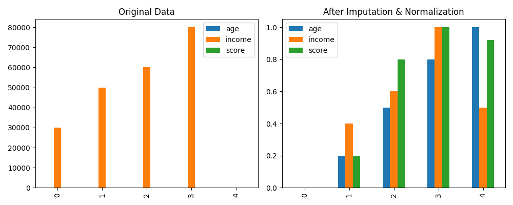
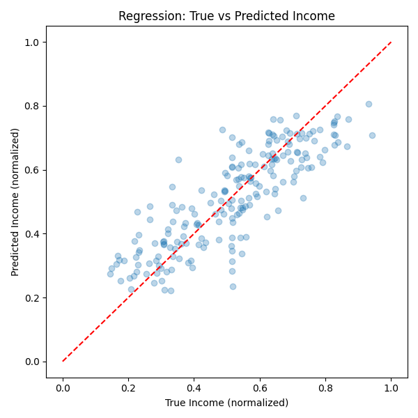

# ML Data Pipeline

A flexible, configurable data preprocessing and transformation pipeline library for machine learning workflows.

## Features

- ✅ **Modular Transformers** - Plug-and-play data transformation components
- ✅ **Flexible Configuration** - YAML-based pipeline definitions
- ✅ **Data Validation** - Check data quality and integrity
- ✅ **Common Operations** - Normalize, standardize, impute, filter, deduplicate
- ✅ **Pandas Integration** - Works seamlessly with pandas DataFrames
- ✅ **Easy to Extend** - Create custom transformers by extending base class
- ✅ **Production Ready** - Handles edge cases and missing data gracefully

## Installation

```bash
pip install -r requirements.txt
```

## Quick Start

### Basic Usage

```python
import pandas as pd
from pipeline.core import Pipeline, NormalizeTransformer, ImputeTransformer

# Create data
data = pd.DataFrame({
    'age': [25, 30, None, 45],
    'income': [30000, 50000, 60000, None]
})

# Create pipeline
pipeline = Pipeline()
pipeline.add_transformer(ImputeTransformer(strategy='mean'))
pipeline.add_transformer(NormalizeTransformer())

# Apply
result = pipeline.fit(data)
print(result)
```

### Configuration-Based Pipeline

```python
from pipeline.core import Pipeline, load_pipeline_config

config = {
    'data': df,
    'impute': {'strategy': 'mean'},
    'normalize': {'columns': ['age', 'salary']},
    'drop_columns': {'columns': ['id']}
}

pipeline = Pipeline()
result = pipeline.fit_from_config(config)
```

## Available Transformers

### NormalizeTransformer

Scale values to 0-1 range (Min-Max scaling).

```python
transformer = NormalizeTransformer(columns=['age', 'income'])
```

### StandardizeTransformer

Standardize to zero mean and unit variance (Z-score).

```python
transformer = StandardizeTransformer(columns=['age', 'income'])
```

### ImputeTransformer

Fill missing values using various strategies.

```python
# Mean imputation
transformer = ImputeTransformer(strategy='mean')

# Forward fill (propagate last value)
transformer = ImputeTransformer(strategy='forward_fill')

# Custom value
transformer = ImputeTransformer(strategy='value', value=0)

# Strategies: 'mean', 'median', 'forward_fill', 'backward_fill', 'value'
```

### FilterTransformer

Filter rows based on conditions.

```python
conditions = {
    'age': ('gte', 18),           # age >= 18
    'income': ('gt', 30000),       # income > 30000
    'status': ('eq', 'active')     # status == 'active'
}
transformer = FilterTransformer(conditions)

# Operators: 'gt', 'lt', 'eq', 'gte', 'lte'
```

### DropColumnsTransformer

Remove specified columns.

```python
transformer = DropColumnsTransformer(columns=['id', 'internal_notes'])
```

### SelectColumnsTransformer

Keep only specified columns.

```python
transformer = SelectColumnsTransformer(columns=['age', 'income', 'name'])
```

### DuplicateTransformer

Remove duplicate rows.

```python
transformer = DuplicateTransformer(keep='first')  # 'first', 'last', or False
```

## Data Validation

```python
from pipeline.core import PipelineValidator

validator = PipelineValidator()

# Check null values
nulls = validator.check_nulls(data, threshold=0.5)  # Columns with >50% nulls

# Count duplicates
dup_count = validator.check_duplicates(data)

# Get data types
types = validator.check_data_types(data)

# Comprehensive summary
summary = validator.get_summary(data)
```

## Examples

### Example 1: Customer Data Preprocessing

```python
import pandas as pd
from pipeline.core import Pipeline, ImputeTransformer, FilterTransformer, NormalizeTransformer

# Load customer data
data = pd.read_csv('customers.csv')

# Build pipeline
pipeline = Pipeline()
pipeline.add_transformer(FilterTransformer({
    'age': ('gte', 18),
    'status': ('eq', 'active')
}))
pipeline.add_transformer(ImputeTransformer(strategy='median'))
pipeline.add_transformer(NormalizeTransformer(columns=['lifetime_value', 'purchase_count']))

# Process
cleaned_data = pipeline.fit(data)
cleaned_data.to_csv('customers_cleaned.csv', index=False)
```

### Example 2: Financial Data Pipeline

```python
from pipeline.core import Pipeline, ImputeTransformer, StandardizeTransformer, FilterTransformer

data = pd.read_csv('transactions.csv')

pipeline = Pipeline()
pipeline.add_transformer(FilterTransformer({'amount': ('gt', 0)}))
pipeline.add_transformer(ImputeTransformer(strategy='forward_fill'))
pipeline.add_transformer(StandardizeTransformer(columns=['price', 'volume']))

result = pipeline.fit(data)
```

### Example 3: Data Quality Checks

```python
from pipeline.core import PipelineValidator

validator = PipelineValidator()

# Check for high null percentages
nulls = validator.check_nulls(data, threshold=0.3)
if nulls:
    print(f"Columns with >30% nulls: {nulls}")

# Find duplicates
dup_count = validator.check_duplicates(data)
print(f"Duplicate rows: {dup_count}")

# Full summary
summary = validator.get_summary(data)
print(summary)
```

## Demonstration

Below is a visualization of the data before and after running the basic ML data pipeline (imputation and normalization):



- **Left:** Original data with missing values and unnormalized features.
- **Right:** Data after imputation (mean fill) and normalization (scaled to 0-1).

To generate this plot yourself, run:

```bash
$env:PYTHONPATH="$(Get-Location)\src"; python examples.py
```

This will create `output.png` in your project directory.

## Regression Demonstration with More Data

Below is a visualization of the regression results using a larger synthetic dataset:



- The scatter plot shows the relationship between the true and predicted (normalized) income values on the test set.
- The closer the points are to the red dashed line, the better the model's predictions.

To generate this plot yourself, run:

```bash
$env:PYTHONPATH="$(Get-Location)\src"; python examples.py
```

This will create `regression_output.png` in your project directory.

## Project Structure

```
ml-data-pipeline/
├── src/
│   └── pipeline/
│       ├── __init__.py
│       └── core.py          # Pipeline & transformers
├── examples.py              # Usage examples
├── configs.py               # Configuration examples
├── requirements.txt
└── README.md
```

## Creating Custom Transformers

Extend `DataTransformer` to create custom operations:

```python
from pipeline.core import DataTransformer
import pandas as pd

class CustomTransformer(DataTransformer):
    def transform(self, data: pd.DataFrame) -> pd.DataFrame:
        df = data.copy()
        # Your transformation logic here
        return df

# Use in pipeline
pipeline = Pipeline()
pipeline.add_transformer(CustomTransformer())
```

## Performance Considerations

- **Large Datasets**: Pipeline works with pandas; consider using chunks for very large files
- **Memory**: Transformers create copies; use in-place operations carefully
- **Order Matters**: Arrange transformers in logical order (impute before normalize)

## Troubleshooting

**ValueError: data key not found**

- Ensure 'data' key is in config dictionary when using `fit_from_config()`

**Column not found**

- Transformer skips missing columns; verify column names

**NaN after normalization**

- May occur with constant columns; filter/drop before normalizing

## Future Enhancements

- [ ] Support for categorical encoding
- [ ] Outlier detection & handling
- [ ] Feature scaling with sklearn integration
- [ ] Cross-validation pipeline
- [ ] Parallel processing for large datasets
- [ ] Streaming data support
- [ ] Pipeline serialization

## License

MIT
